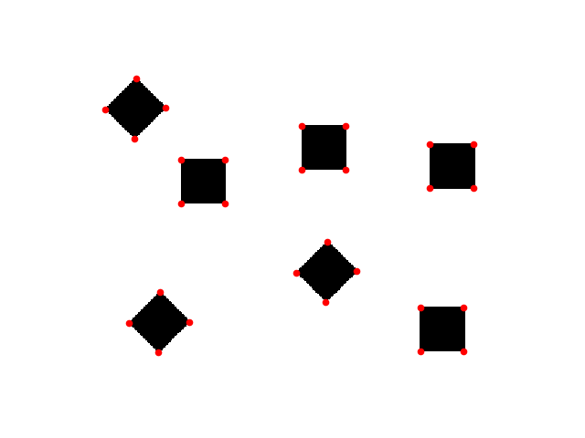
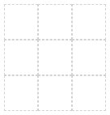
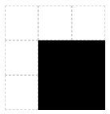
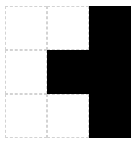

# Naive Corners

A naive algorithm to find corners on a image.



## About

When I was still studying the basics of digital image processing I came up with this "algorithm" to detect corners on a image.

## How it works

Well, as the name suggests, this is a very naive approach.

Given any image we will look at it a window of 3 by 3 at a time. (We could resize the image to speed up the process, but who's in a hurry?)

3x3 window.  


We will then just count how many colored pixels we have at that window. If there's 4 colored pixels, it must be a corner.

Corner.  


Rotated corner.  


Anything else, is not a corner.

Not a corner.  


Not a corner either.  


## See it working

Run by calling
```bash
python corner.py img/mess.png
```

I also used this algorithm to process corners on a [real time webcam video](https://youtu.be/OWOQL5jh_7A).
